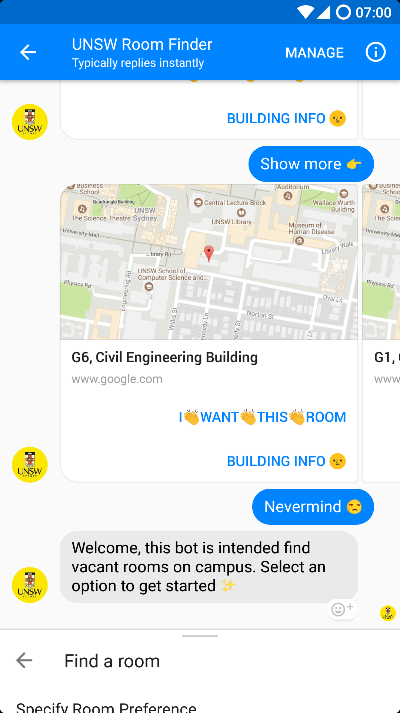

# Quickstart (for marking/tutors)

To make it easier to run our bot, we have uploaded the complete dist/ folder to this repo - this includes the transpiled code and a config file that connects to our demo pages and databases. The Facebook data must be updated with your own data, because Messenger bots require developer apps set up to use (unless they have been verified, which is outside of project scope).

Please make sure you have nodejs (LTS - v6) installed before doing the following:

1. Clone the repo
    * *Optionally* run `make` to have a fresh `dist/` folder based on current `src/` folder
2. Open `dist/config/secret.json` and edit the "facebook" object with your demo page data (page access token, verify token, app secret, and app id), then save
3. `$ cd dist/`
4. `$ node src/app.js`

The bot should now be running on port 443 - you can use a reverse proxy such as nginx or ngrok to tunnel the Facebook messenger webhooks to the bot instance. These tunnels must be over *HTTPS* (not just HTTP), otherwise Facebook will complain!

If you use the bot on the page corresponding to the data you provided in the `config.json` file, it should now reply! 😊

For detailed docs on ***all the provided functions*** in the source code, [visit this link.](http://z5016959.web.cse.unsw.edu.au/docs/index.html) The rest of the documentation, including demo screenshots can be seen in this README right here.

## Setup Wit.ai (if NLP is desired)
1. Sign up for a Wit.ai account here: https://wit.ai
2. Click `https://wit.ai/AL_Allen/CampusRoomBookingBot`
3. Paste *your* server access token into the `dist/config/secret.json` file
4. Provide the token from Wit.ai to your Facebook bot page, in the "NLP" section in "Messenger" settings

NLP should now be available for top-level functions such as Help (type "What do I do?", or "Help me"), and finding random rooms (try "Any rooms?", or "Anything free?").

# Project structure

The structure of this project is as follows:

- config/
    - Contains all config templates and data
- dist/
    - Pre-transpiled js, which can run in Node.js LTS
- docs/
    - Bot documentation, generated by documentation.js based on code comments
- nlp/
    - Natural Language Processing models and entities, downloaded from our training set and data from wit.ai
- screenshots/
    - Screenshots to be shown in the README below
- scripts/
    - Docker and build script utilities
- src/
    - Main source code folder - all business logic and code sits in here
- test/
    - Some rudimentary tests
- /
    - Root folder contains all js rc files, npm files, makefile, dockerfile, and README itself

# Quick usage demo (main application features)
## Start off by clicking "Get started"
<a></a>

---

## Get some help by typing "help", or selecting Help from the menu
<a></a>
<a></a>
<a></a>

---

## Report various issues by selecting Report Issue from the menu
<a></a>
<a></a>
<a></a>
<!-- <a></a> -->

---

## Find a random free room by selecting Feeling Lucky
<!-- <a></a> -->
<a></a>
<a></a>
<a></a>
<!-- <a></a> -->

---

## Find a room more suited to your time or location by providing constraints
<a></a>
<a></a>
<a></a>
<!-- <a></a> -->
<!-- <a></a> -->

---

<!-- <a></a>

--- -->

# Advanced

Considering installing the following:

- [jq](https://stedolan.github.io/jq/): a tool for manipulating json in the CLI as it'll help with the build
- [docker](https://www.docker.com): where most of the build will be running

## To build the docker image

```
./scripts/docker-build.bash
```

## To run the app

First you'll want to make a copy of the config and enter your
API keys in to config/secret.json. This file isn't commited to
source so you can generate an empty one with this.

```
make config/secret.json
```

Once the server is running i'll refresh after each change
to source code.

```
# to start server on 8080
./scripts/docker-make.bash run 8080 run

# to stop
docker kill comp9323_make__run
```

## Auto build

This runs the build, it'll wait for changes before running

```
# to start
./scripts/docker-make.bash devserver 1234 watch

# to stop
docker kill comp9323_make__devserver
```

## Authors

* **Allen Li**
* **Angus**
* **Zaki**

## License

This project is licensed under the MIT License - see the [LICENSE.md](LICENSE.md) file for details
